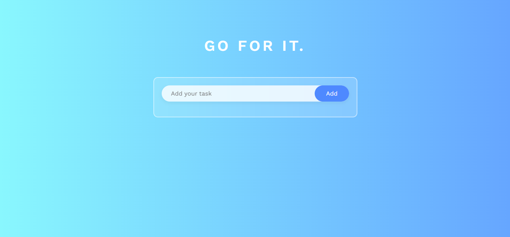
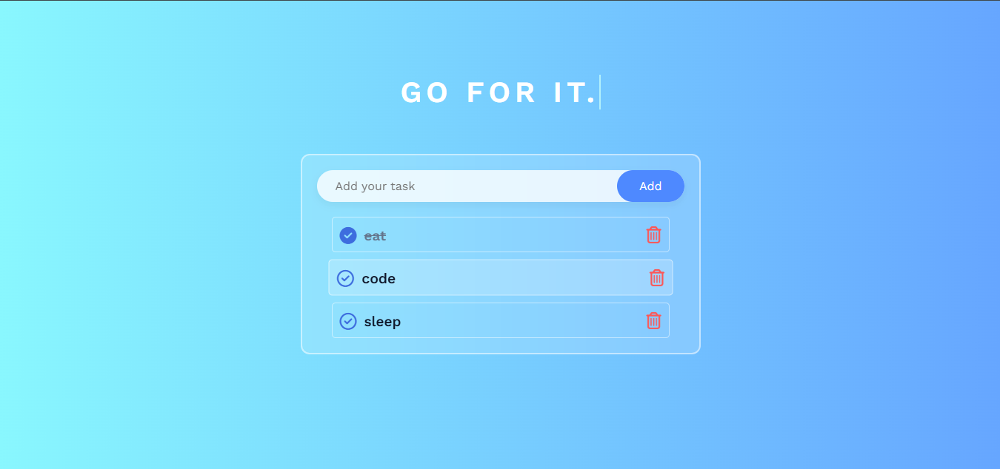

# 📝 ToDo List App

A modern, responsive ToDo list application built with PHP, MySQL, JavaScript, jQuery, and AJAX.  
Users can add, complete, edit, and delete tasks dynamically with real-time feedback.

> 🚀 **Live Demo:** <a href="https://todoiist.free.nf/" target="_blank">todoiist.free.nf</a>

---

## 🌟 Features

- ✅ Add, edit, and delete tasks
- 🔁 Toggle task completion
- ♻️ Data stored persistently in MySQL
- ⚡ Instant UI updates via AJAX
- 🎨 Responsive UI with icons and animation

---

## 🖼️ Screenshots

### 💻 Desktop View




---

## ⚙️ Technologies Used

- **Frontend**
  - HTML5, CSS3, JavaScript
  - jQuery & Font Awesome
- **Backend**
  - PHP (OOP)
  - MySQL (PDO)
- **Other**
  - AJAX for asynchronous updates
  - Hosted on [Free Hosting - InfinityFree](https://infinityfree.net/)

---

## 🚀 How to Run Locally

1. Clone the repository:

```bash
git clone https://github.com/Sa3d-Ka/Todo-List-PHP-SQL.git
cd Todo-List-PHP-SQL
````

2. Import the database:

   * Open `phpMyAdmin`
   * Create a new database (e.g. `todo_app`)
   * Import the SQL from `todolist.sql`

3. Configure your database:

   * Update `config/database.php` with your DB credentials

```php
private $host = "localhost";
private $db_name = "todo_app";
private $username = "root";
private $password = "";
```

4. Start your local server (XAMPP, MAMP, etc.) and navigate to:

```
http://localhost/Todo-List-PHP-SQL/
```

---

## 📁 Project Structure

```
📦 Todo-List-PHP-SQL/
├── 📁 css/
│   └── style.css
│
├── 📁 js/
│   └── app.js
│
├── 📁 images/
│   └── favicon.png
│
├── 📁 server/
│   ├── 📁 api/
│   │   ├── list_tasks.php
│   │   ├── add_task.php
│   │   ├── delete_task.php
│   │   └── update_task.php
│   └── 📁 config/
│       └── database.php
│
├── 📄 index.html
└── 📄 README.md
```

---

## 🙌 Credits

* Designed & Developed by **Saad Kanani**
* Icons by [Font Awesome](https://fontawesome.com/)
* Hosted via [InfinityFree](https://infinityfree.net/)

---

## 📬 Contact

📧 [saad.kanani.off@gmail.com](mailto:saad.kanani.off@gmail.com)
🔗 [LinkedIn](https://linkedin.com/in/saad-kanani) | [Portfolio](https://sa3d-ka.github.io/My-Portfolio/)

---

⭐ If you like this project, don’t forget to star the repo!
